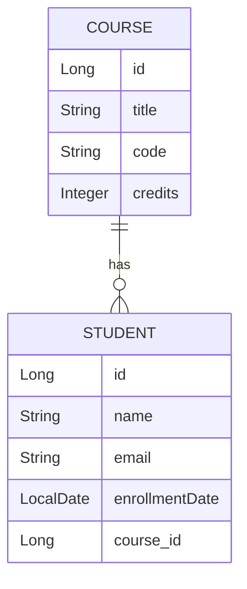

# Student-Course CRUD Application Report

## Project Overview

This Spring Boot application manages two related entities: Students and Courses. It implements create, read, and update operations through JSP pages, uses Spring Data JPA for persistence, and starts with 10 sample rows in each table.

## Entity Relationship Design

The application uses a one-to-many relationship:

- One `Course` can have many `Student` records.
- Each `Student` belongs to exactly one `Course`.



## Implementation Details

### Populate Database

`DataInitializer` inserts 10 courses and 10 students on application startup. Hibernate creates the schema automatically from JPA annotations, and H2 stores the demo data in memory.

### Create Operation

The application provides JSP forms for adding students and courses. Form submissions are handled by Spring MVC controllers, validated with Jakarta Bean Validation, and saved through service classes. Duplicate student emails and duplicate course codes are handled with user-friendly validation errors.

### Read Operation

The student and course list pages fetch data through the service layer. `StudentRepository.findStudentCourseDetails()` uses a JPQL inner join between `Student` and `Course` and returns a DTO projection for display on the student list page.

### Update Operation

Existing students and courses can be edited from the list pages. Controllers load the existing record, display it in a JSP form, and save updates through the service layer.

## Key Files

- `src/main/java/com/example/app/domain/Student.java`
- `src/main/java/com/example/app/domain/Course.java`
- `src/main/java/com/example/app/repository/StudentRepository.java`
- `src/main/java/com/example/app/repository/CourseRepository.java`
- `src/main/java/com/example/app/service/StudentService.java`
- `src/main/java/com/example/app/service/CourseService.java`
- `src/main/java/com/example/app/controller/StudentController.java`
- `src/main/java/com/example/app/controller/CourseController.java`
- `src/main/webapp/WEB-INF/views/students/list.jsp`
- `src/main/webapp/WEB-INF/views/students/form.jsp`
- `src/main/webapp/WEB-INF/views/courses/list.jsp`
- `src/main/webapp/WEB-INF/views/courses/form.jsp`

## Testing

Repository tests use `@DataJpaTest` to verify persistence and the inner join query. Service tests use Mockito to verify create, read, and update business logic.

Run tests with:

```bash
mvn test
```

## Challenges Faced

- JSP support in Spring Boot 3 requires Jakarta-compatible JSTL dependencies and a JSP view resolver.
- The student list page needs course details, so the student repository fetches the related course to avoid lazy-loading issues in the JSP view.
- Duplicate values are enforced by database constraints and converted into clear form errors in the controllers.

## Screenshots

Add screenshots here after running the application:

- Student list with joined Student-Course table
- Add student form
- Update student form
- Course list
- Add course form
- Update course form

## GitHub URL

Add the final GitHub repository URL here:

`https://github.com/<your-username>/<your-repository>`
